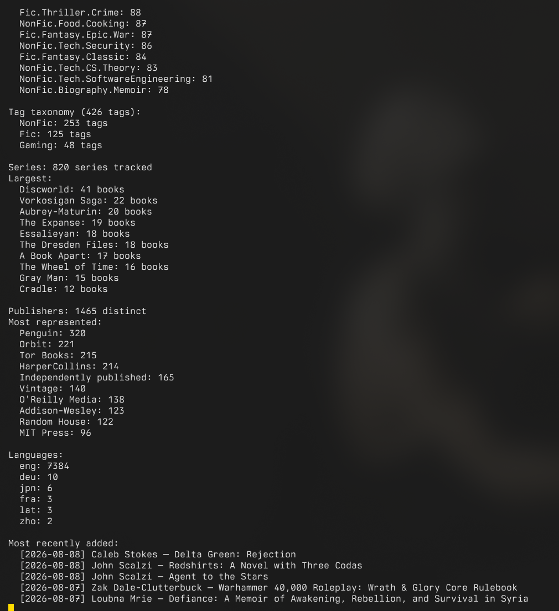

<p align="center">
  
</p>

<p align="center">
  <a href="https://www.python.org/"></a>
  <a href="LICENSE"></a>
</p>

<p align="center">
  
</p>

A CLI and TUI toolkit for Calibre users who treat their libraries as curated collections. 

> **Architecture Note:** CalibreQuarry acts as the frontend interface for the [cquarry](../cquarry/) shared library. The database connection logic and the Calibre search grammar engine were extracted into the `cquarry` package so that other tools in the ecosystem (like Hermitage and Carrel-calibre-web) can guarantee identical behavior and query resolution.

Reads `metadata.db` directly — no `calibredb` dependency, no JSON intermediaries.


> **Note:** This is considered completed software. It is effectively feature complete; bug fixes will be addressed as they come, but no new features are planned. It has been thoroughly tested and is known to be fully functional on the primary development environment: **Fedora Linux 44 (Workstation Edition)**, kernel `7.0.9-205.fc44.x86_64`, using **Calibre 9.8** on **Python 3.14**. While it is pure Python and should be cross-platform, this specific setup is the only officially tested environment.

## Contents

- [Why this exists](#why-this-exists)
- [Features](#features)
- [Installation](#installation) · [Requirements](#requirements)
- [Usage](#usage) · [Recipes](#recipes)
- [Sample output](#sample-output)
- [Search syntax & virtual library resolution](#search-syntax--virtual-library-resolution)
- [Troubleshooting](#troubleshooting)
- [How it reads the database](#how-it-reads-the-database)
- [Full help output](#full-help-output)
- [Companion scripts](#companion-scripts)

## Why this exists

Calibre is a good database. It is not a good reporting tool. If you maintain a large library (3000+ books) organized with virtual libraries, hierarchical tags, and series tracking, you eventually want answers to questions Calibre's UI doesn't surface well: which series have gaps, how many books are unrated, what does a given wing actually contain, and can I get a machine-readable export without running `calibredb list` through a parser script.

This tool reads the SQLite database directly in read-only mode. It ships a near-complete port of Calibre's own search engine (field prefixes like `tags:`, `author:`, `series:`, `rating:`, `pubdate:`; `vl:` cross-references; boolean and hierarchical matching), so your existing wing definitions and search habits work without being re-encoded anywhere.

## Features

| Mode | Flag | Description |
|------|------|-------------|
| **Catalog** | `--catalog` | Formatted text catalog grouped by author, with ratings and series info |
| **All wings** | `--all-wings` | Generate a separate catalog file for every virtual library |
| **Statistics** | `--stats` | Format breakdown, rating distribution, tag taxonomy, publisher counts |
| **Audit** | `--audit` | Report untagged, unrated, coverless, low-resolution-cover and cover-file-missing books; deprecated-format-only and duplicate books; detect series gaps; list books with pending OPF sync |
| **Recent** | `--recent N` | Show the N most recently added books (default: 20) |
| **Series** | `--series` | List all series with completeness status and gap detection |
| **Analytics** | `--analytics {author,pace,tags,overlap}` | Per-author breakdowns, reading-pace trend, tag-taxonomy tree, Wing-overlap analysis |
| **Export** | `--export` | Full library export to JSON, CSV, or an AI-readable flat format (includes native page counts) |
| **LibraryThing** | `--exportlt` | Export library to LibraryThing formatted CSVs (can be combined with `--search`) |
| **Annotations** | `--export-annotations` | Dump e-reader highlights, bookmarks, and notes as JSON (scope to one book with `--id`) |
| **Set title** | `--set-title BOOK_ID TITLE` | Rename a book through cquarry's opt-in write module (trigger-safe; refreshes the sort key and queues an OPF regeneration). Close Calibre first |
| **Write verbs** | `--set-authors`, `--set-rating`, `--set-comments` / `--clear-comments`, `--set-column` / `--clear-column`, `--remove-book [--confirm-remove]` | Core opt-in write surface via cquarry ≥1.5: authors (author_sort recomputed), ratings (0–5), comments HTML, generic custom columns (enum-validated, non-editable refused) and guarded book removal (dry-run by default) |
| **Write verbs, expanded** | `--add-tag` / `--remove-tag`, `--set-identifier` / `--clear-identifier`, `--set-series` (+ `--series-index`) / `--clear-series`, `--set-publisher` / `--clear-publisher`, `--set-languages` / `--clear-languages`, `--add-format` / `--remove-format`, `--set-cover` | Full coverage of cquarry ≥1.5's write module: tags (orphaned rows pruned), identifier EAV upserts, series assignment with index, publisher, language lists (canonicalized `English` → `eng`), format registration/removal, and the has-cover flag. All queue OPF regeneration via `metadata_dirtied` |
| **Book detail** | `--book BOOK_ID` | Full dossier for one book: identifiers, format files with catalogued sizes and on-disk paths, cover, comments (HTML stripped), custom columns, annotations, per-device reading progress, plugin data, conversion overrides |
| **Entities** | `--entities KIND` | List `authors`/`series`/`publishers`/`tags`/`languages`/`ratings` with book counts; authors/series/publishers carry their sort and link columns |
| **Reading progress** | `--reading-progress` | Every recorded reading position across devices with progress bars, newest first |
| **Custom columns** | `--columns` | Custom-column schema: label, search location, datatype, editability, enum values |
| **Library info** | `--info` | Library dossier: identity UUID, wings with their defining expressions, saved searches, `@Name` user categories, grouped search terms, news feeds, conversion overrides, and the sync queues Calibre will consume |
| **Format stats** | `--format-stats` | Per-format book counts and total catalogued bytes |
| **Search** | `--search QUERY` | Books matching a Calibre search expression; prints to stdout, or to a file with `--output`. Grouped-search terms and `annotations:` work too |
| **Wings** | `--wings` | List all virtual libraries with book counts |
| **Tags** | `--tags` | Flat dump of every tag with its book count |
| **Version** | `--version` | Show version and exit |

Modifiers: `--show-tags` swaps ratings for tag display in catalogs, `--show-id` prefixes each book with its Calibre ID (useful for scripting against `calibredb set_metadata`), `--show-custom COL` loads a Calibre custom column, `--primary-only` collapses multi-author entries to the first author, `--format {json,csv,ai}` selects the output shape for `--export` and `--search`, `--plugin-data NAME` appends a third-party plugin value (e.g. `goodreads_id`, `wordcount` from Calibre's `books_plugin_data` table) to catalog and search lines, `--output PATH` writes to a file instead of stdout, `--quiet` suppresses decorative output.

Running with no arguments launches a full-screen interactive TUI (arrow-key navigable) with a built-in scrollable output pager, or a text-based menu if `curses` is unavailable. The TUI remembers your database path between sessions. Its menu covers every read mode above plus a **Write (Calibre closed)** section: an *Edit Book* submenu (title, authors, rating, tags, series, publisher, languages, identifiers, comments, custom columns, cover flag, formats — all backed by the same writeops executors as the CLI) and a guarded *Remove Book* flow (dry run first, then a double confirmation).

## Installation

```bash
pip install .
# or
pipx install .
```

`cquarry` (the library) and `vir-tui` are git dependencies tracked at `@main` —
every fresh install picks up the newest upstream, never a pinned release. There
is deliberately no committed `uv.lock`: `uv sync` re-resolves the latest on
every run. If you want a frozen environment anyway, generate a lock locally
(`uv lock`) and keep it out of version control.

This gives you the `cquarry` command:

```bash
cquarry --catalog --db ~/Calibre/metadata.db
cquarry --stats
cquarry   # launches interactive TUI
```

Or run without installing:

```bash
PYTHONPATH=src python -m cquarry_cli --stats
```

## Requirements

Python 3.14+. Requires `cquarry` and `tqdm` (`sqlite3`, `json`, `csv`, `argparse`, `curses`, `re`, `unicodedata`, `datetime`).

(3.14 is the tested floor, matching the development environment. The code does not lean on bleeding-edge language features, so it is likely fine on somewhat older interpreters, but only 3.14+ is supported.)

## Usage

```bash
# Build a catalog for a specific wing
cquarry --catalog --wing "The Tabletop" --primary-only --db ~/Calibre/metadata.db

# Same catalog, but showing tags instead of star ratings
cquarry --catalog --wing "The Tabletop" --show-tags --db ~/Calibre/metadata.db

# Catalog with Calibre IDs (for piping into calibredb set_metadata scripts)
cquarry --catalog --show-id --db ~/Calibre/metadata.db

# Generate catalogs for all virtual libraries at once
cquarry --all-wings --db ~/Calibre/metadata.db --outdir ~/docs/catalogs

# Library statistics
cquarry --stats --db ~/Calibre/metadata.db

# Audit: find unrated books, missing tags, series gaps
cquarry --audit --db ~/Calibre/metadata.db --output audit.csv

# Rename a book in place (writes via cquarry's WritableCalibreDB; queues an
# OPF regeneration so Calibre picks the change up on its next startup)
cquarry --set-title 42 "Dune Messiah" --db ~/Calibre/metadata.db

# Recently added books
cquarry --recent 10 --db ~/Calibre/metadata.db

# Series completeness and gap detection
cquarry --series --db ~/Calibre/metadata.db

# Extended analytics: per-author stats, reading pace, tag tree, wing overlap
cquarry --analytics author --db ~/Calibre/metadata.db
cquarry --analytics pace --db ~/Calibre/metadata.db

# Export full library to JSON (or CSV, or an AI-readable flat format)
cquarry --export --db ~/Calibre/metadata.db --format json --output library.json

# Search with a Calibre expression — prints to the terminal by default
cquarry --search 'series:Mistborn and rating:>=4' --db ~/Calibre/metadata.db

# Same search as JSON, written to a file
cquarry --search 'tags:Fic.SciFi and pubdate:>2015' --format json --output recent_scifi.json

# Display a custom column alongside catalog/export output
cquarry --catalog --show-custom "Status" --db ~/Calibre/metadata.db

# List all virtual library wings with counts
cquarry --wings --db ~/Calibre/metadata.db

# Run a named saved search straight from Calibre's preferences
cquarry --search 'search:"Needs Filtering"' --db ~/Calibre/metadata.db

# Count-operator queries: books with more than two formats, or zero identifiers
cquarry --search 'formats:#>2' --db ~/Calibre/metadata.db
cquarry --search 'identifiers:#=0' --db ~/Calibre/metadata.db

# Export e-reader highlights and notes as JSON (whole library or one book)
cquarry --export-annotations --db ~/Calibre/metadata.db --output highlights.json
cquarry --export-annotations --id 42 --db ~/Calibre/metadata.db

# Show Goodreads IDs / word counts recorded by plugins next to each book
cquarry --catalog --plugin-data goodreads_id --db ~/Calibre/metadata.db

# Dump every tag with its book count (replaces `calibredb list_categories -r tags`)
cquarry --tags > ~/docs/catalogs/tags.txt

# Check version
cquarry --version
```

If `metadata.db` is in the current directory or at `~/Calibre Library/metadata.db`, the `--db` flag can be omitted. On first run you'll be prompted for the path, which is saved to `~/.config/cquarry/config.json` for future sessions. If Calibre is running and has the database locked, CalibreQuarry (cquarry-cli) will automatically read from a temporary snapshot.

## Recipes

Common questions mapped to a single command. These assume `--db` is configured (omit it after the first run). `--search` prints to the terminal; add `--output FILE` to save, or `--format json|csv|ai` to change the shape.

**Curation and triage**

```bash
# What haven't I rated yet?
cquarry --search 'rating:false'

# Unrated books in a specific genre
cquarry --search 'tags:Fic.Fantasy and rating:false'

# Books with no cover, or a cover so small it should be replaced
cquarry --search 'cover:false'
cquarry --audit                       # low_res_cover rows, plus cover_file_missing
                                      # where the database claims a cover the disk lacks

# Books I have only as PDF (conversion / re-acquisition candidates)
cquarry --search 'formats:PDF and not formats:EPUB'

# Books with no ISBN recorded
cquarry --search 'not identifiers:isbn:true'

# Everything still in a deprecated-only format, plus duplicates and series gaps
cquarry --audit --output audit.csv
```

**Discovery and reading planning**

```bash
# Top-rated science fiction
cquarry --search 'tags:Fic.SciFi and rating:5'

# Added in the last month / since a date
cquarry --search 'date:30daysago'
cquarry --search 'date:>=2026-01-01'

# Everything by an author (substring; quote names with spaces)
cquarry --search 'author:"Brandon Sanderson"'

# Which series are incomplete, and what's missing
cquarry --series

# What's actually inside a wing
cquarry --catalog --wing "Sci-Fi Wing" --output scifi.txt
```

**Exporting and feeding other tools**

```bash
# A whole wing as a compact, token-efficient list for an LLM prompt
cquarry --search 'tags:Fic.Fantasy' --format ai --output fantasy.ai.txt

# Export to CSV instead of JSON:
cquarry --export --format csv --output library.csv

# Export specifically formatted CSVs for LibraryThing, filtered to books added recently:
cquarry --search 'date:>2026-08-05' --exportlt
```

This exports `librarything_main.csv` and `librarything_read.csv` (split into chunks if necessary), stripping `0101-01-01` sentinel dates, parsing translator fields into distinct tags, and converting ISBN-10s into ISBN-13s to prevent spreadsheet tools from dropping leading zeroes.

## Sample output

### Catalog (`--catalog`)

```
Calibre Library Export — 2026-03-27 19:38 [The Tabletop]
========================================================

[Avery Alder]
-------------
  * The Quiet Year [PDF]

[Emmy Allen]
------------
  * The Gardens of Ynn [PDF]
  * The Stygian Library [PDF]

[Aaron Allston]
---------------
  * Dungeons and Dragons Rules Cyclopedia [PDF] [★★★★☆ 4.0/5]
```

### Statistics (`--stats`)

```
=== Library Statistics (3853 books) ===

Formats:
  EPUB    2571  ██████████████████████████
  PDF     1208  ████████████
  DJVU      65
  MOBI       8
  AZW3       3

Ratings:
  ★★★   (3.0)     81  █
  ★★★★  (4.0)   2031  ████████████████████████████████████████
  ★★★★★ (5.0)    135  ██
  Unrated:        1579  (41.0%)

Tag taxonomy (392 tags):
  NonFic: 276 tags
  Fic: 98 tags
  Gaming: 17 tags
```

### Series (`--series`)

```
  A Song of Ice and Fire: 5 of 5 (complete)
  Asian Saga: Chronological Order: 4 of 6 (incomplete)  ⚠ missing: 2, 3
  Aubrey-Maturin: 20 of 20 (complete)
  Discworld: 41 of 41 (complete)
  Parker: 10 of 18 (incomplete)  ⚠ missing: 8, 9, 10, 11, 12, 13, 14, 15
```

## Search Syntax & Virtual Library Resolution

CalibreQuarry (cquarry-cli) ships a pure-Python search engine (`src/cquarry/search.py`) that ports Calibre's grammar and matching semantics as closely as the standard library allows. The same engine resolves Virtual Libraries (Wings) directly from the `preferences` table and powers the `--search` CLI mode, so your existing wing definitions work unchanged.

```
# Virtual Library Definitions
Fantasy Wing:    tags:"Fic.Fantasy" or tags:"Fic.Speculative.Fantasy"
The Tabletop:    tags:"Gaming.TTRPG"
Unsorted:        not (vl:"The Tabletop" or vl:"Fantasy Wing" or ...)

# CLI Search Queries
cquarry --search 'NOT(tags:Fic.Romance OR tags:Fic.Contemporary)'
cquarry --search 'tags:"Fic.Fantasy.Grimdark" AND author:"Phil Tucker"'
```

### Supported Search Features

* **Field locations**: `title`, `authors`/`author`, `author_sort`, `series`, `publisher`, `tags`/`tag`, `rating`, `formats`/`format`, `languages`/`language`, `pubdate`, `timestamp`/`date`, `last_modified`, `identifiers`/`identifier`/`isbn`, `comments`/`comment`, `cover`, `id`, `uuid`, `#custom` columns, plus `all` and `vl:`.
* **General Text Search**: An un-prefixed term (e.g., `Rice`) is matched across title, authors, series, publisher, tags, and comments.
* **Hierarchical tags**: `tags:Fic.Fantasy` matches `Fic.Fantasy` and everything below it (`Fic.Fantasy.Epic`, `Fic.Fantasy.Grimdark`, ...). Prepend `=` for an exact match: `tags:"=Fic.Fantasy"`.
* **Match kinds**: contains (default; case- and accent-insensitive), `=` exact, `~` regex, `^` accent.
* **Numbers and dates**: relational operators on numeric fields (`rating:>=4`, `id:<100`) and dates (`pubdate:>2015`, `date:>=2024-01-01`, `timestamp:30daysago`); `field:true`/`field:false` test presence/absence.
* **Boolean logic**: `AND`, `OR`, `NOT`, with implicit `AND` between space-separated terms (`tags:Fic tags:SciFi` == `tags:Fic AND tags:SciFi`), and parentheses for grouping (`(tags:Fic OR tags:NonFic) AND NOT tags:Gaming`).
* **Virtual Library Referencing**: `vl:"Wing Name"` cross-references an existing Wing (recursion is detected and reported).
* **Empty query**: an empty `--search ''` returns the whole library, matching Calibre.

#### Parity scope (minimal-dependency (uses tqdm) deviations)

Matching is near-complete but not bit-for-bit identical to Calibre, by design: CalibreQuarry (cquarry-cli) has zero dependencies, while a few of Calibre's behaviors are tied to third-party libraries.

* `~` regex uses Python's stdlib `re`, not Calibre's `regex` module (`\X`, `VERSION1` semantics differ).
* Accent/contains folding uses `unicodedata` (NFKD), not ICU, so it is accent- and case-insensitive but not punctuation-insensitive.
* GPM templates (`@...:`) and saved-search references (`search:`) are not evaluated.
* `tags:` is **anchored-hierarchical** (matches `Foo` and `Foo.*`), where Calibre's raw default is an unanchored substring. This is intentional and is what curated dotted taxonomies want; use `=` for strict exact.

### Custom columns

Custom columns are referred to by **two different names**, which is easy to trip over:

| Where | Which name | Example |
|-------|-----------|---------|
| `--show-custom` | the column's **display name** (what you see in Calibre) | `--show-custom "Status"` |
| `--search` (the `#` prefix) | the column's **lookup name** (label), prefixed with `#` | `--search '#reading_status:Read'` |

These two names are often different (display "Status", lookup `reading_status`). In Calibre, the lookup name is the one shown in *Preferences → Add your own columns* under "Lookup name"; the `#` search prefix always uses that one. If `--show-custom` reports "not found", the error lists the valid display names.

**Watch the contains-vs-exact trap on enumerations.** A custom search is a substring match by default, so `#reading_status:Read` also matches `Reading` and `To Read` (both contain "read"). For the exact value, use `=`: `#reading_status:=Read`. Quote values with spaces: `#reading_status:"=To Read"`.

### Quote Handling (`"` and `'`)

When running searches via the command line with `--search`, you must navigate your shell's quote-escaping rules. Items can be explicitly `""`'d or written unquoted (if they do not contain spaces).

1. **Wrap the entire query in single quotes (`'`)**: This prevents your bash/zsh shell from trying to interpret spaces or special characters.
2. **Use double quotes (`"`) inside the query**: Use double quotes around tag names, author names, or virtual library names if they contain spaces.

**Good Examples:**
```bash
cquarry --search 'NOT(tags:Fic.Romance OR tags:Fic.Contemporary)'
cquarry --search 'tags:"Fic.Fantasy.Grimdark" AND author:"Phil Tucker"'
cquarry --search "author:Anne Rice"  # Handled natively as author:Anne AND Rice
```

**What to Avoid:**
* Unquoted spaces will break your shell command: `cquarry --search tags:Fic OR tags:SciFi` (Your shell thinks `OR` is a separate argument; instead use `--search 'tags:Fic OR tags:SciFi'`).
* Mismatched quotes will cause parsing errors: `cquarry --search "tags:'Fic.SciFi'"` (Calibre expects double quotes `"` internally, not single quotes).

### Automated Test Suite

The whole suite runs without a Calibre library (stdlib `unittest`, ~273 tests):

- **Modes** (`tests/test_modes.py`): catalog-mode cache isolation, output-directory creation and wing-filename uniqueness, and the audit's cover checks, all against a temporary database.
- **TUI** (`tests/test_tui.py`): fallback-menu generation, prompt/cancel semantics, non-ASCII prompt input, and the persistent-screen session lifecycle.
- **Companion scripts** (`tests/test_scripts.py`, `tests/test_reconcile.py`, `tests/test_audit_drm.py`, `tests/test_audit_isbns.py`): `compress_pdf.py` size-sync and backup guards, `spot_check.py` lints and review-ledger paths, the reconcile diff/parse logic, DRM classification, and the ISBN arithmetic, printed-ISBN extraction, and verdict rules behind `audit_isbns.py`.

Run them with `PYTHONPATH=src python -m unittest discover -s tests` (the same command CI runs). The shell scripts `run_tests.sh` (every CLI mode) and `test_queries.sh` (representative `--search` queries) smoke-test against a real library.

## Troubleshooting

**A search or wing returns nothing.**
- Tags are anchored-hierarchical: `tags:Fic` matches `Fic` and `Fic.*`, but not a tag that merely contains "fic" in the middle. Use the full dotted path, or `=` for an exact leaf (`tags:"=Fic.SciFi.Cyberpunk"`).
- Check the wing name with `cquarry --wings`; names are case-sensitive and must match Calibre exactly. Quote names with spaces: `--wing "Sci-Fi Wing"`.
- A field prefix that Calibre supports but cquarry does not (templates `@...:`, saved searches `search:`) matches nothing. See [Parity scope](#parity-scope-minimal-dependency (uses tqdm)-deviations).

**"Database not found" or it points at the wrong library.**
- Pass `--db /path/to/metadata.db` (or a directory containing it). The resolved path is saved to `~/.config/cquarry/config.json`; delete that file or pass `--db` to reset it.

**The shell mangles my query.** Wrap the whole expression in single quotes and use double quotes inside: `cquarry --search 'tags:"Fic.Fantasy.Grimdark" AND author:"Phil Tucker"'`. Without single quotes, your shell treats `OR`/`AND`/parentheses as separate arguments.

**"Custom column not found" (`--show-custom`).** Use the column's *display* name (e.g. `Status`); the error lists the available names. Note the asymmetry: `--show-custom` wants the display name, but a `#` search wants the *lookup* name (`#reading_status`). See [Custom columns](#custom-columns).

**A `#custom` search matches too many rows.** Custom searches are substring matches, so `#reading_status:Read` also catches `Reading` and `To Read`. Use `=` for an exact value: `#reading_status:=Read`.

**Calibre is open / the database is locked.** Expected. cquarry prints a notice to stderr, reads from a temporary snapshot, and cleans it up on exit. Results reflect the last saved state.

**Boxes or stars look like garbage in the TUI.** The interface uses Unicode box-drawing and star glyphs and a 256-color terminal. If `curses` is unavailable, cquarry falls back to a plain text menu automatically; piping or redirecting output disables color.

## How it reads the database

CalibreQuarry (cquarry-cli) opens `metadata.db` in read-only mode (`?mode=ro`). It never writes to the database. All data comes from standard Calibre tables: `books`, `authors`, `tags`, `series`, `ratings`, `data`, `publishers`, `languages`, `identifiers`, `comments`, and `preferences`. Custom columns are not required, but are read on demand for `--show-custom` and `#column` searches.

If Calibre is running and holds a lock on the database, CalibreQuarry (cquarry-cli) copies it (along with any WAL/SHM journal files) to a temporary snapshot and reads from that. A notice is printed to stderr; the temp files are cleaned up on exit.

Calibre stores ratings on a 0–10 scale internally (where 10 = 5 stars). CalibreQuarry (cquarry-cli) converts to the standard 0-5 star display automatically.

## Replacing shell-based catalog pipelines

If you previously generated catalogs through a `calibredb list → JSON → parser` pipeline, `--all-wings` replaces that entire workflow with a single command. No temp files, no intermediate JSON, no shell glue functions.

The `--show-id` flag outputs Calibre book IDs, making it straightforward to pipe results into `calibredb set_metadata` for batch operations.

## Full help output

```
usage: cquarry [-h] [--version] [--catalog | --all-wings | --stats |
               --analytics {author,pace,tags,overlap} | --audit |
               --recent [RECENT] | --series | --export | --search QUERY |
               --wings | --tags | --book BOOK_ID | --entities KIND |
               --reading-progress | --columns | --info] [--exportlt]
               [--export-annotations] [--id BOOK_ID] [--plugin-data NAME]
               [--db DB] [--wing WING] [--output OUTPUT] [--outdir OUTDIR]
               [--format {json,csv,ai}] [--primary-only] [--show-tags]
               [--show-id] [--show-custom COL_NAME] [--show-author-details]
               [--quiet] [--set-title BOOK_ID TITLE]
               [--set-authors BOOK_ID NAMES] [--set-rating BOOK_ID STARS]
               [--set-comments BOOK_ID HTML] [--clear-comments BOOK_ID]
               [--set-column BOOK_ID LABEL VALUE]
               [--clear-column BOOK_ID LABEL] [--add-tag BOOK_ID TAG]
               [--remove-tag BOOK_ID TAG]
               [--set-identifier BOOK_ID TYPE VALUE]
               [--clear-identifier BOOK_ID TYPE] [--set-series BOOK_ID NAME]
               [--series-index NUM] [--clear-series BOOK_ID]
               [--set-publisher BOOK_ID NAME] [--clear-publisher BOOK_ID]
               [--set-languages BOOK_ID LANGS] [--clear-languages BOOK_ID]
               [--add-format BOOK_ID FORMAT NAME SIZE]
               [--remove-format BOOK_ID FORMAT] [--set-cover BOOK_ID YES/NO]
               [--remove-book BOOK_ID] [--confirm-remove] [--format-stats]

Calibre library toolkit: catalog, stats, audit, export

options:
  -h, --help            show this help message and exit
  --version             show program's version number and exit
  --catalog             Build a text catalog
  --all-wings           Generate catalogs for all virtual libraries
  --stats               Show library statistics
  --analytics {author,pace,tags,overlap}
                        Extended analytics and visualizations
  --audit               Report issues (untagged, unrated, series gaps)
  --recent [RECENT]     Show N most recently added books (default: 20)
  --series              List all series with completeness and gap detection
  --export              Export library to JSON, CSV, or AI format
  --search QUERY        Show/export books matching a Calibre search expression
                        (prints to stdout unless --output is given; empty
                        query = whole library). Supports custom grouped-search
                        terms (GroupName:query) and annotations: full-text
                        over e-reader highlights
  --wings               List all virtual library wings
  --tags                Dump every tag with its book count
  --book BOOK_ID        Show the full record for one book: identifiers, format
                        files, cover, comments, custom columns, annotations,
                        reading progress
  --entities KIND       List an entity class with book counts
                        (authors/series/publishers include sort and link
                        columns)
  --reading-progress    Show per-device reading positions with progress bars,
                        newest first
  --columns             List custom columns: type, editability, enum values
  --info                Library dossier: identity, wings + expressions, saved
                        searches, @Name user categories, grouped search terms,
                        feeds, sync queues
  --exportlt            Export to LibraryThing CSV format (can be used alone
                        or with --search)
  --export-annotations  Dump e-reader highlights/bookmarks/notes as JSON
                        (optionally scoped with --id)
  --id BOOK_ID          Scope --export-annotations to a single Calibre book id
  --plugin-data NAME    With --catalog or --search: append a books_plugin_data
                        value (e.g. goodreads_id, wordcount) to each book line
  --db DB               Path to Calibre metadata.db (auto-detected if omitted)
  --wing WING           Filter to a specific virtual library wing
  --output OUTPUT       Output file path
  --outdir OUTDIR       Output directory for --all-wings (default: current
                        dir)
  --format {json,csv,ai}
                        Output format. --export defaults to json; --search
                        defaults to a plain-text listing unless a format is
                        given here
  --primary-only        Use only the first author (useful for TTRPG
                        collections)
  --show-tags           Show tags instead of ratings in catalog output
  --show-id             Prefix each book with its Calibre ID for scripting
  --show-custom COL_NAME
                        Load and display a specific custom column
  --show-author-details
                        With --catalog/--all-wings/--export/--search: append
                        each author's true sort key and link URL (from
                        cquarry's entity secondary columns) to the output
  --quiet               Minimize output

write verbs (Calibre must be closed):
  --set-title BOOK_ID TITLE
                        Rename a book
  --set-authors BOOK_ID NAMES
                        Replace authors ("Name One; Name Two"; ; = separator)
  --set-rating BOOK_ID STARS
                        Set rating (0-5, halves allowed)
  --set-comments BOOK_ID HTML
                        Set the comments/description HTML
  --clear-comments BOOK_ID
                        Clear the comments/description
  --set-column BOOK_ID LABEL VALUE
                        Write a custom-column value (#label; enumerations are
                        validated against the column's configured values)
  --clear-column BOOK_ID LABEL
                        Clear a custom-column value
  --add-tag BOOK_ID TAG
                        Attach a tag (repeat the flag for several)
  --remove-tag BOOK_ID TAG
                        Detach a tag (repeat the flag for several)
  --set-identifier BOOK_ID TYPE VALUE
                        Upsert an identifier (isbn, goodreads, ...); empty
                        VALUE deletes it
  --clear-identifier BOOK_ID TYPE
                        Delete one identifier type
  --set-series BOOK_ID NAME
                        Assign the series (index 1.0 unless --series-index; ""
                        clears)
  --series-index NUM    With --set-series: the book's number in the series
  --clear-series BOOK_ID
                        Remove the book from its series
  --set-publisher BOOK_ID NAME
                        Replace the publisher
  --clear-publisher BOOK_ID
                        Remove the publisher
  --set-languages BOOK_ID LANGS
                        Replace languages ("en, fr" — English names or ISO
                        codes)
  --clear-languages BOOK_ID
                        Remove all languages from the book
  --add-format BOOK_ID FORMAT NAME SIZE
                        Register a format row (metadata only — the file must
                        already sit in the book's folder as NAME.format)
  --remove-format BOOK_ID FORMAT
                        Drop a format row (leaves the file on disk untouched)
  --set-cover BOOK_ID YES/NO
                        Toggle the catalogued has_cover flag
  --remove-book BOOK_ID
                        Permanently remove a book (dry run unless --confirm-
                        remove)
  --confirm-remove      With --remove-book: actually delete instead of dry-
                        running
  --format-stats        Show per-format book counts and total bytes
```

## Companion scripts

The `scripts/` directory holds standalone maintenance tools. They are **not** part of the `cquarry` package and deliberately sit **outside its read-only contract**: they are run directly with `python3`, and several of them write. They are minimal-dependency (uses tqdm) Python; some shell out to external command-line tools. Each is designed to run from inside a Calibre library directory (they locate `metadata.db` relative to themselves), so deploy a copy into your library root or pass paths explicitly.

### `compress_pdf.py` — shrink oversize PDFs (writes)

Re-encodes a bloated PDF (think 1 GB TTRPG sourcebooks) through Ghostscript with a quality preset, but only after verifying the result: it aborts if the page count changes or the output isn't smaller, and it keeps the original as `<name>.pre-compress.pdf`. If the file lives in a Calibre library, it syncs the new size back to the database (core `data.uncompressed_size`, plus the Count Pages plugin's `books_pages_link.format_size` if present) so Calibre doesn't see a stale size. A busy or locked database is handled gracefully: the PDF is still replaced and you are told to re-run with Calibre closed.

> **This script modifies files and `metadata.db`.** It is the reason the companion scripts live outside the `calibrequarry` package. Back up before a bulk run; close Calibre first.

Requires `gs` (Ghostscript); optionally uses `pdfinfo` / `pdfimages` / `pdfdetach` (poppler) for page-count verification and the `--inspect` report.

```bash
python3 scripts/compress_pdf.py book.pdf                 # /ebook (150 dpi), in place + rollback copy
python3 scripts/compress_pdf.py book.pdf --preset screen # smaller, lower quality
python3 scripts/compress_pdf.py book.pdf --dry-run       # compress to a temp file, replace nothing
python3 scripts/compress_pdf.py ./Library --inspect      # per-file recommendation, no changes
python3 scripts/compress_pdf.py book.pdf --out-dir ~/out # write a copy elsewhere; original untouched
```

Exit codes: `0` compressed/verified (or clean inspect), `1` aborted (no shrink, page-count mismatch), `2` setup error (Ghostscript missing, unreadable file).
Exit codes: `0` clean (THIN is advisory), `1` a real problem (foreign content, baked page numbers, empty book, OCR-damaged prose) or a scan error, `2` setup error.

### `audit_drm.py` — flag DRM-locked files across every format (read-only)

Scans ebook files for DRM, which the metadata and structural audits never inspect. A DRM-locked file can pass `epubcheck`, report its page count, and even import, yet silently refuse to let its embedded metadata be rewritten (the case that prompted this tool was a PDF carrying a residual Adobe ADEPT `EBX_HANDLER` dictionary that `qpdf` and `pdfinfo` both called "not encrypted" while `exiftool` choked on it).

The hard part is not detecting encryption; it is not crying wolf. Two benign things look like DRM to a crude check and are explicitly cleared:

- **font obfuscation**: an EPUB may carry `META-INF/encryption.xml` that scrambles only its embedded fonts (the IDPF or Adobe font-mangling algorithms). That is not DRM. Obfuscated fonts are sometimes named `fonts/00001.dat` with no font extension, so an entry is cleared when it uses a font-scrambling algorithm *or* targets a font resource.
- **permission flags**: a PDF may be "encrypted" with the Standard handler and an empty user password: it opens with no password and is only flagged against printing/copying. That is not a lock.

Detection per format: EPUB (an `encryption.xml` that encrypts content documents is DRM; a standalone `rights.xml` or `sinf.xml` with no content encryption is a residual marker from a freed book and is reported benign, since the content reads and embeds fine), PDF (a non-Standard security handler found by a streaming byte scan, so a residual/inactive dictionary is still caught because for PDF it still breaks metadata embedding; active Standard encryption is classed with `qpdf` into password-locked vs permissions-only), Kindle MOBI/AZW3 (the record-0 encryption-type field), DJVU (no DRM scheme, reported N/A). It opens `metadata.db` strictly `mode=ro`.

```bash
python3 audit_drm.py                  # scan every file in the library (from the library dir)
python3 audit_drm.py ~/Downloads      # vet loose files before importing them
python3 audit_drm.py --csv drm.csv    # also write a CSV audit (id,status,kind,detail,path)
```

Exit codes: `0` clean (no DRM; font obfuscation and permission flags are not DRM), `1` DRM found or a scan error, `2` setup error.

### `audit_isbns.py` — check stored ISBNs against the books themselves (read-only)

Every other audit here asks whether the catalogue is internally consistent. This one asks what nothing in the Calibre ecosystem asks: does the ISBN recorded against a book actually identify *that* book? Calibre downloads metadata but never re-examines what it stored, so a wrong ISBN is invisible forever, and it matters because an ISBN is what other systems key on. Hand a catalogue to a library service and the ISBN, not the title, decides which book you get.

The failure is real and quiet. A sweep of a 6,786-ISBN library that was already validator-clean found 51 identifiers pointing at something else, most often a **sibling** of the right book: the same publisher's next title, so the number looks plausible and the checksum passes. *Programming Clojure* carried *tmux 2*'s ISBN; *Spelunky* carried *Super Mario Bros. 3*'s; *A Book on C* carried `9782147483649`, which is the 2147483649 integer-overflow constant wearing an ISBN's clothes.

For books no bibliographic database has heard of (small-press RPGs, indie ebooks, print-on-demand reprints) the publisher's own copyright page is the best authority there is, and it is already on disk.

**It reads body text only, never a file's embedded metadata.** `reconcile_file_metadata.py` exists to write the database's values *into* those metadata blocks, so comparing against them would be comparing the database with itself and would confirm every error this tool was built to find.

The hard part is not finding printed ISBNs; it is not crying wolf. Three benign things look like a mismatch and are classified apart:

- **citations**: books quote other books' ISBNs constantly, and one citation is indistinguishable from a self-identification if you only count numbers. *The Atrocity Archives* names *The New Hacker's Dictionary*'s ISBN in a glossary entry; *Metamagical Themas* lists one among Hofstadter's self-referential joke titles; *C++ Primer Plus* advertises six other Sams books. So a number counts as the book's own only when copyright-page furniture sits near it (a copyright line, a rights reservation, a binding, a printing statement, a CIP block) — positive evidence, rather than an attempt to enumerate every way a citation can look. This gates only the *negative* direction: a book printing the same ISBN you store is conclusive regardless of context, since a citation coinciding with your own stored value does not happen.
- **bibliographies**: a book that cites other books prints their ISBNs (*The Art of UNIX Programming* prints 49). Above `--max-printed` distinct ISBNs a file is read as a citing work and its numbers are not treated as evidence about itself.
- **bundles and series**: a boxed set prints each component's ISBN and a series volume may print its siblings'. Several printed ISBNs with no match is reported `AMBIGUOUS`; a human picks, the tool does not guess.
- **format variants**: print and ebook editions differ only in the last digits. When the printed and stored numbers share a registrant prefix the finding is `VARIANT` (same publisher, probably another binding) rather than `MISMATCH` (a different publisher block, where a genuinely wrong ISBN sits).

**The printed ISBN can itself be wrong.** That is the limit of this tool's premise, and the reason it only ever reports. Two real cases, both flagged `VARIANT` and both resolved in favour of the database: the TSR *Forgotten Realms Campaign Setting* boxed set prints `1-56076-605-0`, which actually belongs to *The Jungles of Chult* (a documented typo, in the book, permanently); and *Night Witches* (Bully Pulpit, 2014) prints *Durance*'s ISBN, because a small press reused its previous title's copyright page without updating it. Both are same-publisher cases, which is precisely why `VARIANT` exists: that shape covers innocent format variants *and* publisher mistakes, and no rule separates them without a human.

There is deliberately **no `--apply`**. Across the sweep that motivated this tool, single-source verdicts were wrong often enough to matter: an auto-fixer would have "corrected" *Curse of Strahd*, *Cold Mountain*, *Kitchen* and *The Master and Margarita*, all of which were right. Findings are for a human to judge.

```bash
python3 audit_isbns.py                        # every book with an ISBN
python3 audit_isbns.py --tag NonFic.Tech      # one branch of the taxonomy
python3 audit_isbns.py --id 1969,3189         # specific books
python3 audit_isbns.py --format tsv > out.tsv # machine-readable
```

Scoping uses the same anchored-hierarchical `--tag` rule as `fetch_library_codes.py` and cquarry's `tags:` search, and takes a comma-separated list, so a virtual library that spans several roots is covered without a separate flag.

Exit codes: `0` no disagreement, `1` at least one `MISMATCH`/`VARIANT`/`AMBIGUOUS` finding or an unreadable file, `2` setup error.

### `validate_metadata.py` — lint database integrity (read-only)

A linter for `metadata.db` with two layers. It is the database-side companion to `audit_drm.py`, and it is strictly `mode=ro`.

**Integrity layer (always on, zero config).** Taxonomy-agnostic, schema-level problems the UI and `--audit` leave alone: books with no language, one ISBN attached to two books, placeholder (`0101-01-01`) or unparseable publication dates, junk identifier types (`url`, `uri`, `guid`, `isbn13`, ...), an ISBN-10 misfiled under `amazon`/`mobi-asin` (checksum-verified, so genuine ASINs are left alone), and custom-column link rows orphaned by deleted books. Safe to point at any library; needs no configuration.

**Opinionated layer (on when a taxonomy is loaded).** A `taxonomy.json` describes your tag tree, publisher consolidations, and identifier vocabulary, and these checks enforce it: every tag in use must be declared (`TAG_IN_SPEC`), alias publishers must be merged into their canonical (`PUBLISHER_NOT_CONSOLIDATED`), and fiction should not be PDF-only (`FORMAT_FICTION_PDF`). Loading a taxonomy also makes the identifier-type vocabulary authoritative (the `--strict` behavior turns on automatically). A comprehensive, ready-to-adapt template ships as **`scripts/taxonomy.example.json`** (three roots — `Fic` / `NonFic` / `Gaming` — with a deep, single-tag-per-book hierarchy; a branch is a valid tag on its own only when its `bare_allowed` is `true`). A fuller real-world reference in YAML, **`scripts/taxonomy.example.yaml`**, is also included; it is the richer schema used by a separate library-side linter and is provided for reference (the stdlib tools here read the JSON form).

Errors are bad data Calibre or tooling can trip on; warnings are hygiene.

```bash
python3 scripts/validate_metadata.py                   # integrity checks on ./metadata.db
python3 scripts/validate_metadata.py ~/Calibre         # a library directory
python3 scripts/validate_metadata.py library/metadata.db
python3 scripts/validate_metadata.py --strict          # also flag non-canonical identifier types
python3 scripts/validate_metadata.py --quiet           # only problems; truncate long lists

# Opinionated mode: copy the template, edit it to match your tree, drop it
# beside your library (it is auto-detected), or pass it explicitly.
cp scripts/taxonomy.example.json taxonomy.json
python3 scripts/validate_metadata.py --taxonomy taxonomy.json
python3 scripts/validate_metadata.py --no-taxonomy     # force integrity-only
```

Sample output (opinionated mode):

```
Validating /path/to/metadata.db
Taxonomy: /path/to/taxonomy.json

ERRORS (2)
  NO_DUPLICATE_ISBN (1)
    ISBN 9780026581509 appears on books: 6352,6355
  TAG_IN_SPEC (1)
    tag 'Fic.Fantasy.Wierd' is not declared in the taxonomy

WARNINGS (2)
  FORMAT_FICTION_PDF (1)
    #5145 'Vermis I' (tag 'Fic.Fantasy.Weird') is PDF-only; fiction prefers EPUB
  PUBLISHER_NOT_CONSOLIDATED (1)
    publisher 'Tor' should be merged into 'Tor Books'

FAIL: 2 error(s), 2 warning(s).
```

A `taxonomy.json` next to the library, the script, or the working directory is loaded automatically; `taxonomy.example.json` is a template and is never auto-loaded.

Exit codes: `0` clean (warnings do not fail), `1` one or more errors, `2` setup error (no `metadata.db`, or a bad taxonomy file).

### `reconcile_file_metadata.py` — sync DB metadata into book files (writes with `--apply`)

Calibre's `metadata.db` is where you curate titles, authors, series, tags, publishers, dates, identifiers, and blurbs; the copy embedded *inside* each EPUB/MOBI/AZW3/PDF/DJVU is what travels with the book when it leaves the library. Those drift apart whenever you edit metadata in Calibre without re-exporting the file. This script finds that drift and, with `--apply`, closes it. The flow is always database to file; it never reads file metadata back into the database.

It reads the database `mode=ro`, reads each file's embedded metadata with `ebook-meta` (EPUB/MOBI/AZW3/PDF) or `djvused` (DJVU), and diffs a per-format set of fields so a format is never faulted for something it cannot carry (a PDF holds title/author/publisher/date, a DJVU only title/author, an EPUB the full record). Default is a dry-run report. `--apply` touches only the drifted files, with a writer chosen per format: `calibredb embed_metadata` for EPUB/MOBI/AZW3 (full record plus cover), `exiftool` for PDF (Info dict + XMP; calibredb is skipped for PDF because it silently leaves some PDFs unchanged, whereas exiftool wrote every PDF tested), and `djvused` for DJVU. It refuses `--apply` while Calibre is running unless you pass `--force`. `--apply` needs `calibredb` and `exiftool` on PATH (the dry run does not). A few PDFs carry a damaged cross-reference table that exiftool refuses to write; pass `--repair-pdf` to rebuild it in place with `qpdf --replace-input` (page count preserved) and retry the embed. It is opt-in because it structurally rewrites the file.

```bash
python3 scripts/reconcile_file_metadata.py                 # dry-run report, ./metadata.db
python3 scripts/reconcile_file_metadata.py ~/Calibre       # a library directory
python3 scripts/reconcile_file_metadata.py --sample 50     # a random 50 books (quick look)
python3 scripts/reconcile_file_metadata.py --id 6688,6690  # specific books
python3 scripts/reconcile_file_metadata.py --format epub   # only EPUB files
python3 scripts/reconcile_file_metadata.py --apply         # embed DB metadata into drifted files
```

Reading every file spawns a subprocess per file, so an unscoped run is slow (tens of minutes for thousands of books); scope it with `--sample` / `--id` / `--format` for a quick look. Sample output:

```
Reconciling /path/to/metadata.db  [5 book(s)]

DRIFT (5 file(s))
  #6688 [EPUB] Slumdog Deckbuilder
      differs: title, series, publisher, pubdate, tags, identifiers, comments
  #5061 [PDF] Rogue Trader: Core Rulebook
      differs: authors
  #2231 [DJVU] The B-Book: Assigning Programs to Meanings
      differs: title, authors

checked 5 file(s): 0 in sync, 5 drifted, 0 unreadable/missing.

Run again with --apply to embed the database metadata into the drifted files.
```

Exit codes: `0` no drift (or `--apply` finished cleanly), `1` drift found (dry run) or an apply/embed step failed, `2` setup error (no `metadata.db`, or a missing external tool).

### `fetch_library_codes.py` — derive LCC/DDC codes from the Library of Congress (writes with `--apply`)

Fills in Library of Congress Classification (and optionally Dewey) codes for books that already carry an ISBN, by querying the Library of Congress SRU catalogue at `lx2.loc.gov:210` and storing what comes back as Calibre identifiers (`lcc`, and with `--write-ddc` also `ddc`). Storing them as identifiers rather than as a column value keeps one canonical home for the data: a composite custom column with the template `{identifiers:select(lcc)}` displays the value without a second copy, and `reconcile_file_metadata.py` carries identifiers into embedded file metadata.

This exists because the "Library Codes - SRU" Calibre plugin cannot do the job. It rejects composite custom columns outright (`library_codes_dialog.py` requires datatype `text`), and its ISBN lookup queries the LCDB index `dc.identifier`, which the server refuses with SRU diagnostic 1/16 "Unsupported index". The index that actually resolves an ISBN is `bath.isbn`.

Two things govern how you run it. First, the Library of Congress rate-limits hard: at 0.6s between requests it starts resetting connections after roughly twenty queries, so the default pacing is 2.0s with exponential backoff, and a run over several thousand ISBNs takes hours. Every result including a miss is cached to `~/.cache/cquarry/library_codes.json`, so an interrupted run resumes for free and a repeat run is instant. Second, coverage is partial and very uneven by subject: academic, technical and canonical titles resolve well, while genre fiction, indie and small-press releases, translations and tabletop material frequently have no record at all. Default is a dry run that reports the hit rate per tag branch, which is the number to look at before committing to a full pass.

```bash
python3 scripts/fetch_library_codes.py                  # dry run over the whole library
python3 scripts/fetch_library_codes.py --sample 200     # dry run, random sample
python3 scripts/fetch_library_codes.py --tag NonFic     # scope by tag prefix (anchored)
python3 scripts/fetch_library_codes.py --id 8541,8542   # specific books
python3 scripts/fetch_library_codes.py --apply          # write the identifiers
python3 scripts/fetch_library_codes.py --apply --write-ddc   # also store ddc
```

Books that already have an `lcc` identifier are skipped unless you pass `--refresh`, so the tool is naturally incremental: run it again after an import and it only queries the new books. `--apply` backs up `metadata.db` to the sibling `.backups` directory first and refuses to run while Calibre is open. Sample output:

```
DRY RUN: 12 book(s) with an ISBN and no LCC
pacing 2.0s between requests; cached results reused

  [1/12] HIT  PS3561.I483 Y68 2024     #299 You Like It Darker
  [2/12] --                            #1009 Cat's Cradle
  [3/12] HIT  PL992.26.K36 C4313 2016  #1089 The Vegetarian

queried 12 book(s); LCC found for 8 (67%)

hit rate by tag branch:
  Fic.Fantasy                       2/4    ##########
  NonFic.Tech                       3/4    ###############
```

Exit codes: `0` completed, `1` aborted after repeated network failure or a write error, `2` setup error (no `metadata.db`, Calibre running under `--apply`, or bad arguments).

### `spot_check.py` — randomized quality audit, with a judgement mode (read-only)

Samples N random books and checks what pattern sweeps miss: metadata field quality (title corruption, junk author entries, mojibake, stub descriptions) and the actual file contents (EPUB archive integrity, spine completeness, text volume; PDF header and page count; DJVU page count). Random sampling is the point. Every record has equal odds of inspection, so the result estimates whole-library quality instead of re-confirming whatever curation already looked at. The exit code is the number of books with hard failures.

```bash
python3 scripts/spot_check.py --n 600 --seed 101      # mechanical pass
```

**Review mode (`--review`) exists because the mechanical checks can only judge shape.** Whether a title is the *right* title, whether an author field holds the person who actually wrote the book, and whether a description describes *this* book are judgements no regular expression can make. Review mode emits full title, author, context, and complete description in numbered chunks, takes back a verdict file, and keeps the answers in a ledger so reviewed books drop out of later samples and the judging accumulates across sessions instead of being redone.

```bash
python3 scripts/spot_check.py --n 200 --review --batch 100    # emit chunks + .ids
python3 scripts/spot_check.py --record verdicts.tsv --against spot_review.001.ids
python3 scripts/spot_check.py --worklist                      # the BAD punch list
```

Verdicts are three per book, `OK` or `BAD` for title, author, and comment, plus an optional note. **Recording refuses to write unless the verdict ids reconcile exactly with the ids emitted**, in either direction:

```
REFUSED: 1 of 3 emitted id(s) have no verdict: [5315]
REFUSED: 1 id(s) not in r.001.ids: [9999]
REFUSED: 1 malformed line(s): line 1: author is 'YES', want OK or BAD
```

That check is the load-bearing part. A reviewer working through hundreds of records silently drops some, and a short list is indistinguishable from a complete one; this has bitten repeatedly on real work. Nothing enters the ledger unless the ids agree.

Exit codes: `0` clean, N = number of books with hard failures (capped at 99), `1` from `--record` if the verdicts are malformed or the ids do not reconcile (and nothing is written), `99` setup error.

## Support

If CalibreQuarry (cquarry-cli)'s useful to you and you'd like to chip in:

- liberapay · [liberapay.com/bdkl](https://liberapay.com/bdkl/)
- bitcoin
  ```
  bc1qkge6zr45tzqfwfmvma2ylumt6mg7wlwmhr05yv
  ```
